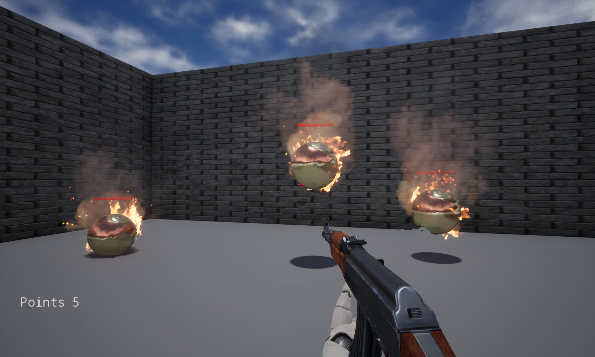
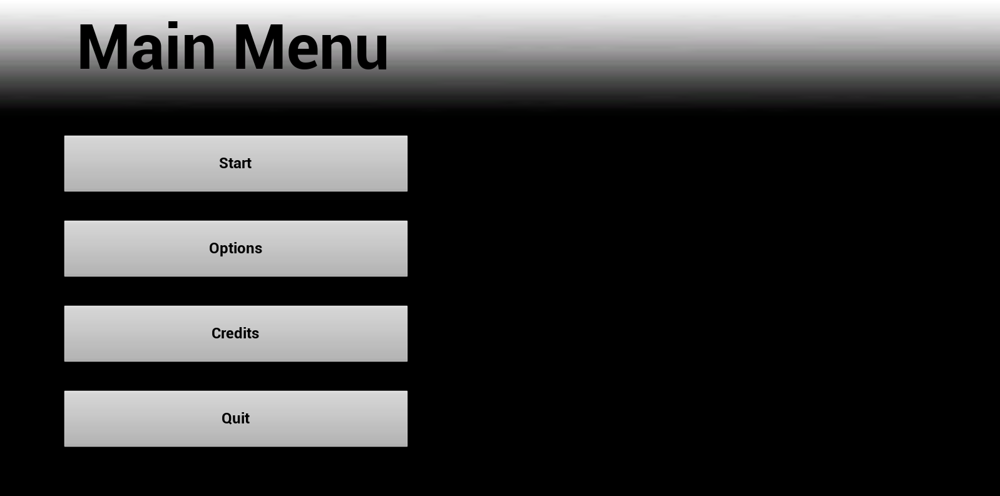
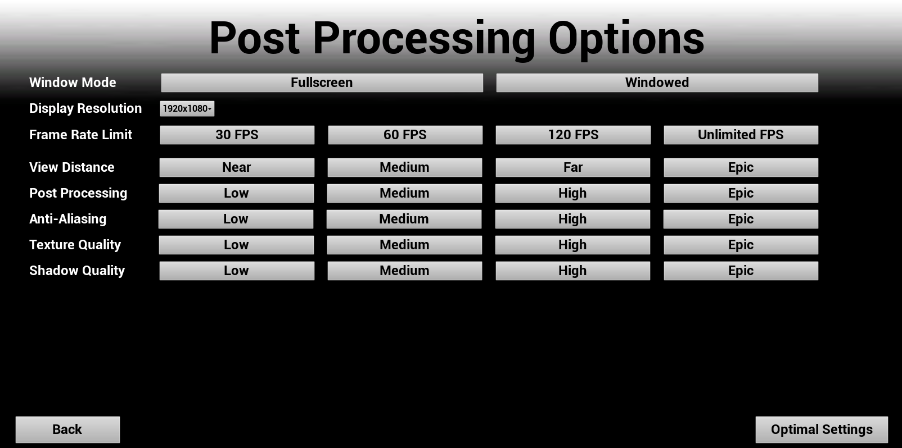

# Infinity_OneButton_Shooter

	<h1>
		
	</h1>
	<h2>
		
	</h1>
	<h3>
		
	</h1>

 

Engine version => 4.25  
SDK => android-30

Clone whole project, Generate Visual Studio files and UE4 files (if needed)